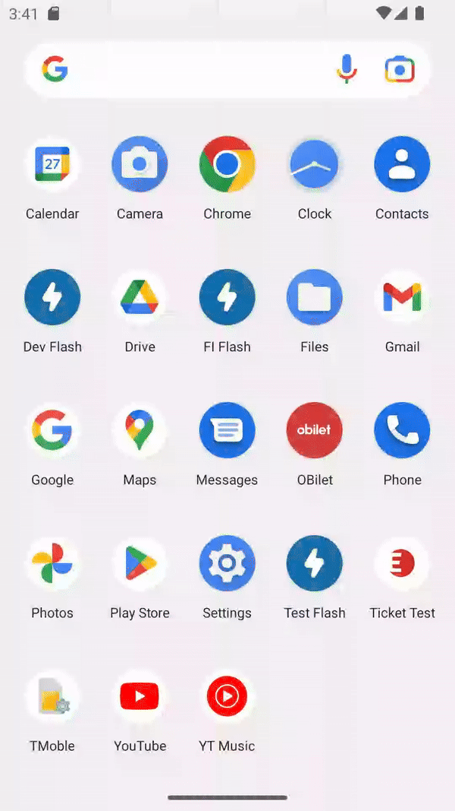
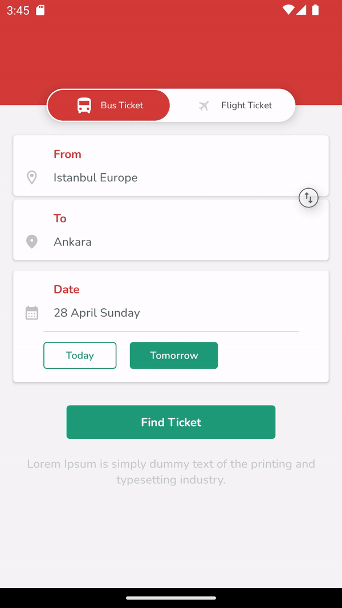
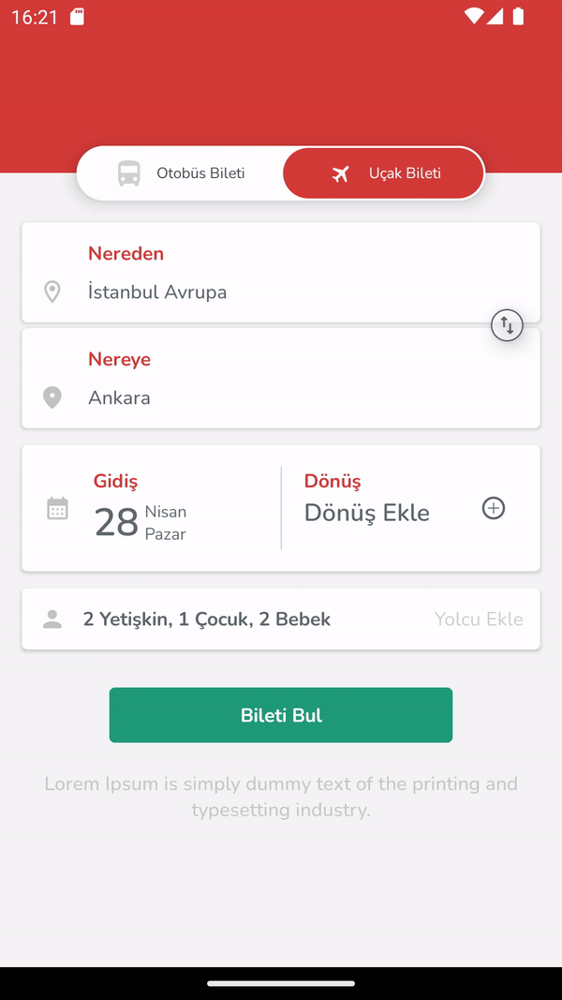
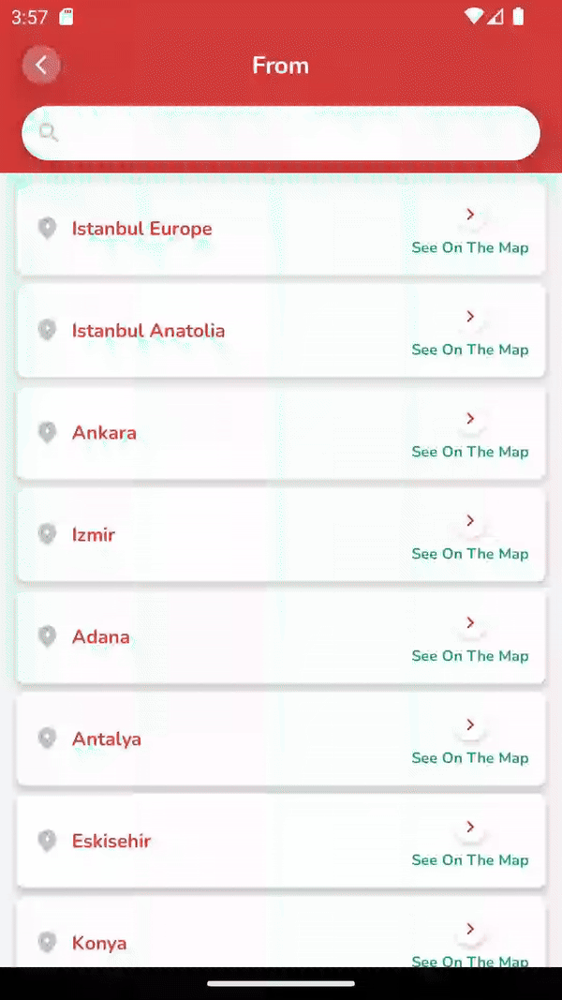
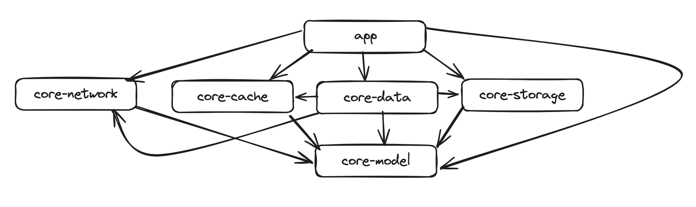

# OBilet Android Assignment

## Features

|                        Splash                         |                                    Bus Section                                    |                                     Flight Section                                      |
|:-----------------------------------------------------:|:---------------------------------------------------------------------------------:|:---------------------------------------------------------------------------------------:|
|  |  |  |

|                                                                           Locations                                                                           |                                  Journeys                                   |
|:-------------------------------------------------------------------------------------------------------------------------------------------------------------:|:---------------------------------------------------------------------------:|
|   |  |

|                                 Passenger Filter                                 |
|:--------------------------------------------------------------------------------:|
|  |

## Tech Features & Libraries

* MVVM Architecture
* XML with Jetpack Compose
* Multi-module
* Kotlin Gradle DSL
* Kotlin Coroutines & Flow
* LiveData

### Libraries
* [Jetpack Compose](https://developer.android.com/develop/ui/compose/setup)
* [Navigation Component](https://developer.android.com/guide/navigation/navigation-getting-started)
* [Retrofit](https://square.github.io/retrofit/)
* [Moshi](https://github.com/square/moshi)
* [okhttp](https://github.com/square/okhttp)
* [MockWebServer](https://github.com/square/okhttp/tree/master/mockwebserver)
* [Truth](https://truth.dev/)
* [Room](https://developer.android.com/training/data-storage/room)
* [Timber](https://github.com/JakeWharton/timber)
* [Coil](https://coil-kt.github.io/coil/)
* [Dagger Hilt](https://dagger.dev/hilt/)

## Module Structure
| Module name                    | Type                | Description                                                                                                            |
|--------------------------------|---------------------|------------------------------------------------------------------------------------------------------------------------|
| [app](/app/)                   | Android Application | Contains all features and binds all of the modules.                                                                    |
| [core-network](/core-network/) | Android Library     | This module contains network related classes such as services, remote data sources, endpoints.                         |
| [core-cache](/core-cache/)     | Android Library     | This module contains cache related classes such as room dao, entity models & cache data sources.                       |
| [core-data](/core-data/)       | Android Library     | This module contains data related classes such as repositories. Also this module connects remote & cache data sources. |
| [core-model](/core-model/)     | Android Library     | This module contains model classes that will be used on the presentation layer.                                        |
| [core-storage](/core-storage/) | Android Library     | This module contains storage related classes.                                                                          |

